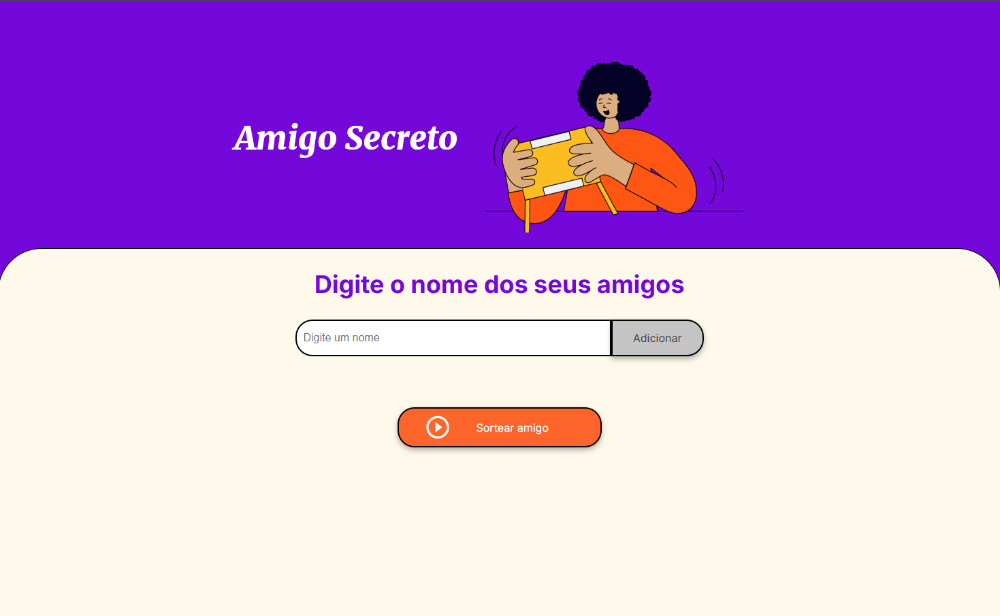

# JOGO DO AMIGO SECRETO 🎮🕹️🎭

---

## Descrição do projeto 💻

Este projeto foi criado como parte da etapa do processo seletivo do programa ONE (Oracle Next Education), em colaboração com a Alura. O objetivo da aplicação é tornar o sorteio de amigo secreto mais simples e eficiente, proporcionando uma experiência divertida e organizada para grupos de amigos, familiares ou colegas de trabalho.

---

## Tecnologias usadas 🚀
- HTML
- CSS
- JavaScript 
- Visual Studio Code

--- 
 ## Funcionalidades 🔘
 - Adiciona amigos ✅
 - Sorteio de amigos secreto ✅
 - Para fazer um novo jogo, basta atualizar a janela do navegador ✅

 ---

 ## Imagem do jogo 🎮📷
 

 ### Como que joga? 🎮🕹️
 1. Abaixo de " *Digite o nome dos seus amigos* ", tem um campo escrito "**Digite um nome**".
 2. No campo "**Digite um nome**", você irá digitar o nome dos participantes do amigo secreto.
 3. Cada nome que você digitar, você clica no botão "**Adicionar**".
 4. Para cada nome de amigo adicionado, irá surgir uma lista com os nomes dos amigos adicionados.
 5. Depois de ter adicionado todos seus amigos, você clica no botão **Sortear amigo** (*O botão na cor laranja*).
 6. Assim que você clicar no botão **sortear amigo**, ira aparecer na tela na cor verde "*Seu amigo secreto é:* " (Exemplo: **Seu amigo secreto é: Pedro**).
 7. Para iniciar um novo sorteio, basta atualizar a aba do navegador.
---
## Desenvolvedor 🧑🏻‍💻
| [ Antonio Tiburtino](https://github.com/antoniotiburtino) |
| :---:
